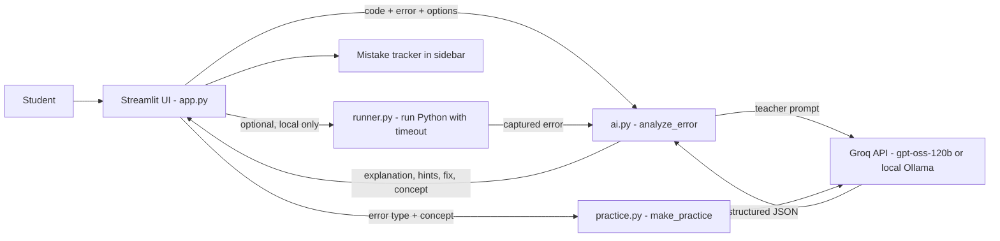

# 🐞 DebugBuddy

AI-powered debugging mentor that guides beginner coders to fix their own bugs through progressive, step-by-step hints and concept explanations instead of just handing out raw solutions.

## Team

**Team Name: MutantX**

| Member | Contribution |
|---|---|
| Prajan Kumar S | BACKEND |
| Rathish | FRONTEND |
| Lalith Sudharsan M M | TESTING |
| DHARUNEASHWAR E | GITHUB |

## Problem Statement

### The Problem
Bridging the Learning Gap in Beginner Coding Education: Beyond Passive AI Code Generation.

### Why We Chose This Problem
As students ourselves, we constantly see peers get stuck on simple compiler errors, panic at cryptic tracebacks, and resort to copy-pasting answers from ChatGPT, fixing the bug in seconds but learning nothing for the exams or real-world coding.

## Solution

DebugBuddy is an AI-powered pedagogical coding assistant that decodes complex execution errors into simple language for beginner programmers. Instead of instantly rewriting the code, it uses a multi-tiered hint system and concept-level explanations that guide students to identify, understand, and fix their own bugs, building real problem-solving skills rather than AI dependency.

### Key Features
- **Learn Mode (progressive hints):** 3 hints revealed one at a time, from a gentle nudge to almost the answer
- **Plain-language error and line decoder:** explains what went wrong and points to the exact line
- **Core concept mini-lessons:** a short explanation of the idea behind the mistake, with a tiny example
- **Fix Mode:** shows the corrected code when the student wants the answer
- **Explanations in English, Tamil, Malayalam, and Hindi**
- **Student level selector:** complete beginner or knows the basics
- **Practice problem generator:** a new broken program with the same kind of bug, with a hidden solution
- **Mistake tracker:** shows which error types the student makes most
- **Example errors dropdown:** 8 common beginner errors to try instantly
- **Run my code mode (local):** paste only the code and DebugBuddy finds the error itself
- **Model choice:** Groq API or a local open-source model through Ollama

## Innovation and Differentiation

**Progressive Cognitive Friction:** Instead of dumping an instant fix, DebugBuddy uses a multi-tiered hint system as a scaffold. It gives students just enough direction (Hint 1 → Hint 2 → Hint 3) to prompt their own "aha!" moment, preserving the learning process. In Learn mode the fix is also removed in code, not just in the prompt, so the answer can never leak.

**Pedagogical AI Prompting:** Rather than using LLMs as raw code generators, DebugBuddy uses structured teacher-style system prompts that turn intimidating tracebacks into bite-sized mental models and concept mini-lessons. It then closes the loop with a practice problem and a mistake tracker, so the student keeps training on their weak spots.

## Technical Implementation

### Architecture



### Technology Stack

| Category | Technologies |
|---|---|
| Frontend | Streamlit |
| Backend | Python (ai.py, practice.py, runner.py) |
| Database | N/A (session state only) |
| AI / ML | gpt-oss-120b (open-weight) via Groq API; optional local Ollama with qwen2.5-coder |
| Infrastructure | Streamlit Community Cloud, GitHub |
| APIs / Services | Groq API |

### How It Works
1. The student pastes code and an error message (or, in local run mode, only the code).
2. In run mode, `runner.py` runs the Python code in a separate process with a 5-second timeout and captures the real error.
3. `ai.py` numbers the code lines, builds a prompt with the language, explanation language, and student level, and sends it to the model.
4. The model returns structured JSON: error type, line number, explanation, 3 hints, fix, and concept.
5. In Learn mode the fix is removed in code before it reaches the UI; hints are shown one at a time.
6. `practice.py` can create a similar exercise from the error type and concept.
7. The error type is added to the mistake tracker in the sidebar.

### Technical Decisions
- **Structured JSON output** from the model, with safe defaults, so the UI never breaks on a bad response.
- **Line numbers added before sending code** to the model, which makes its line detection much more accurate.
- **The fix is stripped in code in Learn mode** instead of trusting the prompt alone.
- **Explanation text describes the problem only**, so it does not spoil the hints.
- **Open-weight model through Groq** for speed and quality, with an Ollama option for fully local use.
- **Run mode is off on the public demo.** Running strangers' code on a shared server is unsafe, so it is enabled only locally with `ENABLE_RUN=1`. The subprocess has a timeout and an empty environment so API keys are not exposed.
- **Streamlit** for a fast, single-language stack that a team of first-year students could finish in one day.

### Implementation During the Hackathon
Everything was built during Hacktoberfest Hack Day: the prompt design and `analyze_error` backend, the Streamlit interface, Learn and Fix modes, multilingual explanations, the student level selector, the practice problem generator, the example errors dropdown, the mistake tracker, the safe code runner, the Ollama option, deployment to Streamlit Community Cloud, and the documentation.

### Team Contributions
- **Prajan Kumar S:** Backend: AI prompts, model integration, practice generator, and deployment
- **Rathish:** Frontend
- **Lalith Sudharsan M M:** Testing
- **DHARUNEASHWAR E:** GitHub repository and documentation

## Working Application

**Live Application:** https://debugbuddy-atwnvibs4f37dbuubepuvw.streamlit.app/

Open the link, choose an example from the dropdown (or paste your own code and error), pick Learn or Fix mode and an explanation language, and click **Help me understand**. You can also click **Give me a practice problem** and watch the mistake tracker in the sidebar. "Run my code" mode is switched off on the public demo for safety and works locally.

## Demo Video

**Demo Video:** https://youtu.be/ufm8n5JLr3w

The video shows the main flow: pick an error, read the explanation, reveal the hints one by one, switch language, try the practice problem, and see the mistake tracker.

## Open Source and AI Usage

### AI / Models
- **gpt-oss-120b (open-weight) via Groq API:** explains errors, writes hints, and generates practice problems
- **qwen2.5-coder via Ollama (optional):** local, offline alternative
- **Claude (Anthropic):** used as an AI assistant for guidance and code help while building the project

### Open Source Components
- **Streamlit:** web interface
- **Requests:** HTTP calls to the model API
- **Python standard library:** subprocess runner
- **Groq API:** model hosting service
- **Ollama:** local model runtime (optional)

## Setup and Usage

### Prerequisites
- Python 3.10 or higher
- A free Groq API key from [console.groq.com](https://console.groq.com)

### Installation
```bash
git clone https://github.com/pkdoodle18-ship-it/DebugBuddy.git
cd DebugBuddy
python -m venv venv
source venv/bin/activate
pip install -r requirements.txt
```

### Environment Variables
```bash
export GROQ_API_KEY="your_key_here"
export ENABLE_RUN=1   # optional: enables local "Run my code" mode
```

### Running the Project
```bash
streamlit run app.py
```

### Usage
1. Paste your code and the error message, or pick an example.
2. Choose Learn or Fix mode, your level, and your explanation language.
3. Click **Help me understand** and reveal the hints one at a time.
4. Use **Give me a practice problem** to train on the same kind of mistake.

## Devpost Submission

**Devpost Project:** DEVPOST_URL_HERE

## Challenges and Learnings
- Getting the model to return clean JSON every time, and stopping the explanation from revealing the fix
- Small models gave wrong line numbers, which we solved by numbering the lines in the prompt
- Running user code safely, which taught us why it should not be exposed on a public demo
- Deploying with secrets and keeping API keys out of the repository
- Working as a team of four with clear ownership of files and Git

## Credits and License

**Credits:** Streamlit, Groq, OpenAI (gpt-oss), Ollama, Alibaba Qwen (qwen2.5-coder), and Anthropic's Claude as an AI assistant. Built at Hacktoberfest Hack Day Coimbatore (INIT Club and iDEA Club, Amrita Vishwa Vidyapeetham), in collaboration with Major League Hacking.

**License:** MIT (see [LICENSE](LICENSE)). Contributions are welcome, see [CONTRIBUTING.md](CONTRIBUTING.md).
